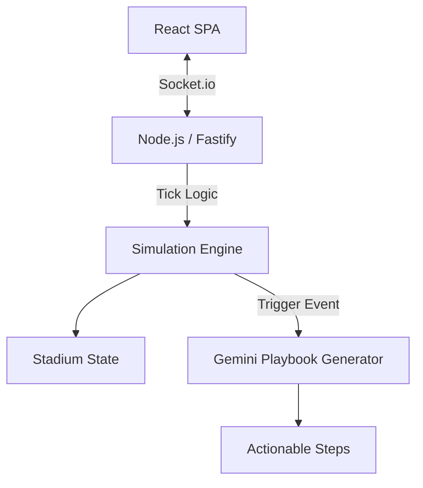

# ArenaFlow Architecture

## High-Level Architecture
ArenaFlow follows a decoupled client-server architecture using WebSockets for real-time telemetry and a RESTful API for health monitoring.

## Folder Structure
- `shared/` - Common TypeScript models, interfaces, and validation schemas.
- `backend/` - Fastify HTTP server, Socket.io broadcaster, Simulation Engine.
- `frontend/` - React 18, Framer Motion, and Tailwind CSS.
- `tests/` - Playwright E2E suites.

## Data Flows
### Frontend Data Flow
1. Socket connection established.
2. `useTelemetry()` hook consumes `stadium_state` events.
3. React context propagates immutable state down the component tree.
4. Memoized components re-render only when specific thresholds are breached.

### Backend Data Flow
1. `SimulationClock` triggers ticks every 1 second.
2. `SimulationEngine` advances base metrics (queue times, flow rates).
3. `Broadcaster` synchronizes deep-cloned state delta to connected clients.
4. `ScenarioManager` mutates state drastically during injected anomalies.

## Lifecycles
- **Simulation Lifecycle:** Ticks 0-95 (representing a 90-minute match + stoppage time).
- **Playbook Lifecycle:** Anomaly Detected -> Gemini API Call -> Playbook Generated -> Operator Approval -> Sequential Execution -> Resolution.
- **Digital Twin Lifecycle:** React SVG overlay interpolates metrics received via WebSocket to visually pulse specific zones (`.glow-pulse`).
